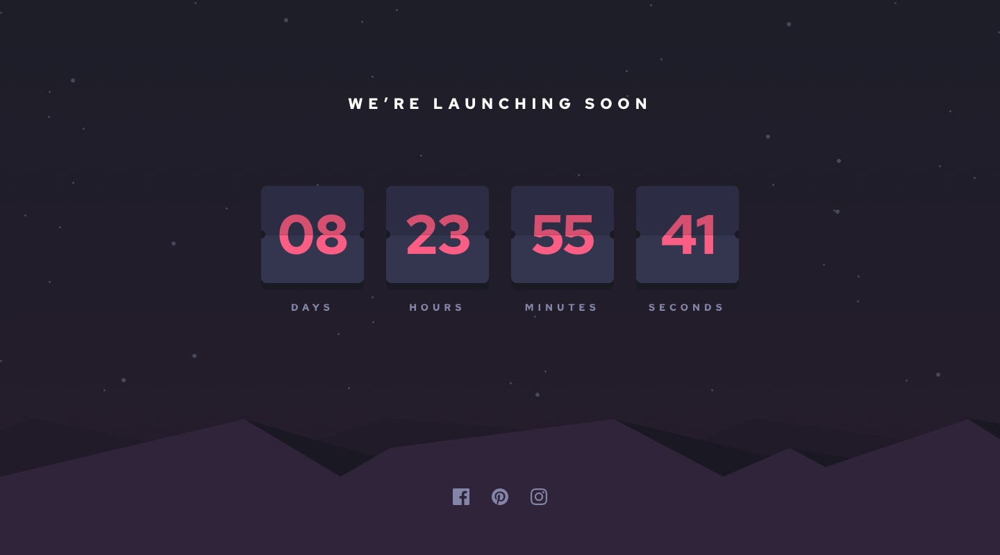

# Frontend Mentor - Launch countdown timer solution

This is a solution to the [Launch countdown timer challenge on Frontend Mentor](https://www.frontendmentor.io/challenges/launch-countdown-timer-N0XkGfyz-). Frontend Mentor challenges help you improve your coding skills by building realistic projects.

## Table of contents

- [Overview](#overview)
  - [The challenge](#the-challenge)
  - [Screenshot](#screenshot)
  - [Links](#links)
- [My process](#my-process)
  - [Built with](#built-with)
  - [What I learned](#what-i-learned)
  - [Continued development](#continued-development)
  - [Useful resources](#useful-resources)
  - [AI Collaboration](#ai-collaboration)
- [Author](#author)

## Overview

### The challenge

Users should be able to:

- See hover states for all interactive elements on the page
- See a live countdown timer that ticks down every second (start the count at 14 days)
- **Bonus**: When a number changes, make the card flip from the middle

### Screenshot

**Desktop**



### Links

- Solution URL: [View solution](https://github.com/troy71/launch-countdown-timer)
- Live Site URL: [View live site](https://troy71.github.io/launch-countdown-timer/)

## My process

### Built with

- Semantic HTML5 markup
- CSS custom properties
- CSS Grid
- Mobile-first workflow
- Vanilla JavaScript (no frameworks)

### What I learned

The main challenge was building a flip-card animation that stays in sync with the timer. The key insight was `animation-fill-mode: both` on the bottom flip panel — without it, the new number was visible during the delay before the bottom half animates in, because the element sits at its default transform (`rotateX(0deg)`) until the animation starts. Using `both` applies the `from` keyframe (`rotateX(90deg)`, edge-on and invisible) immediately, hiding the panel during the delay.

```css
.flip-card.is-flipping .flip-bottom {
  animation: flipBottom 0.34s ease-out 0.34s both;
}
```

To prevent interval drift I schedule each tick relative to the real clock boundary rather than using a fixed `setInterval`:

```js
const driftSafeDelay = Math.max(0, 1000 - (now % 1000) + 5);
timerId = window.setTimeout(tick, driftSafeDelay);
```

### Continued development

- Explore the Web Animations API as an alternative to CSS keyframe + class toggling for more programmatic control over the flip sequence
- Look into `ResizeObserver` for fluid typographic scaling as an alternative to `clamp()` with viewport units
- Investigate `aria-atomic` and `aria-relevant` for more nuanced live region announcements in timers

### Useful resources

- [MDN — animation-fill-mode](https://developer.mozilla.org/en-US/docs/Web/CSS/animation-fill-mode) - Essential for understanding why the bottom panel was showing too early
- [MDN — aria-live](https://developer.mozilla.org/en-US/docs/Web/Accessibility/ARIA/Attributes/aria-live) - Helped shape the accessible live region approach for the timer segments
- [web.dev — prefers-reduced-motion](https://web.dev/articles/prefers-reduced-motion) - Guided the reduced-motion fallback strategy

### AI Collaboration

I used **GitHub Copilot** (Claude Sonnet) throughout this project as a knowledgeable peer for discussing approaches and debugging.

- **Flip animation sync bug** — I could see the new number appearing before the card-top flipped down. Copilot identified that `animation-fill-mode: forwards` doesn't apply the `from` keyframe during a delay, and that changing to `both` was the fix. Understanding _why_ that works (fill-mode applies the keyframe state during the delay period) was more valuable than just the fix.
- **Drift-resistant scheduling** — Discussed the trade-offs between `setInterval` and `setTimeout` chained to the real clock boundary. Went with the latter to avoid cumulative drift.
- **Accessibility** — Pointed out the `aria-label` on a generic `div` validator error and the correct fix (`role="group"`), and confirmed the visually-hidden pattern no longer needs the deprecated `clip` property.

What worked well: using it to talk through trade-offs before implementing, and for catching subtle CSS/ARIA issues. What to watch: always verify explanations against MDN rather than taking them at face value.

## Author

- Website - [My Site](https://github.com/troy71)
- Frontend Mentor - [@troy71](https://www.frontendmentor.io/profile/troy71)
